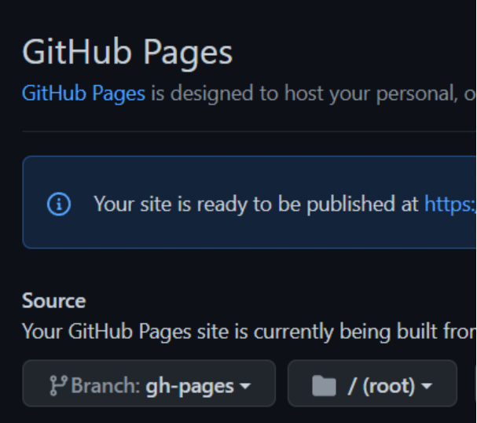
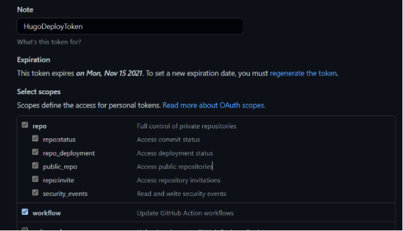
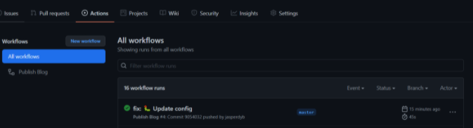

# 建立 Hugo 專案

## 環境

使用 Win10 的 `Windows Subsystem Linux 2 (WSL2)` 中的 `Ubuntu-20.04` 環境。

## 在 WSL 安裝

在 Ubuntu 可以選擇用 apt 安裝，可是官方目前(2021/10/10) 表示 apt 上的套件還有些問題，[會落後幾個版次](https://gohugo.io/getting-started/installing#debian-and-ubuntu)。

所以改用 Brew 進行安裝

```bash
brew install hugo
```

## 建立專案

```bash
hugo new site quickstart

cd quickstart

git init
```


## 應用模板

這邊使用 [Blonde](https://github.com/opera7133/Blonde) 模板，這個模板有用到一些 npm 套件所以要記得安裝。
 
```bash
git submodule add https://github.com/opera7133/Blonde.git themes/Blonde

git submodule update --remote --merge

npm install --prefix themes/Blonde

```

再來直接從模板的範例中複製 `config.toml` 到根目錄。
```bash
cp themes/Blonde/exampleSite/config.toml config.toml
```

## 啟動伺服器

啟動開發用的伺服器。

```bash
hugo server
```

可以在 http://localhost:1313/ 打開


## 新增文章

```bash
hugo new posts/my-first-post.md
```

預設文件會產生在 `content` 目錄下，所以上面的文章會在 `content/posts/` 目錄下。

另外文章產生時預設是草稿狀態，要發布才會被編譯。

```
---
title: "My First Post"
date: 2021-10-10T23:53:49+08:00
draft: true  #要改為 false 後再編譯才會出現
---
```


## 編譯靜態網頁

編譯的指令很簡單。

```bash
hugo
```

編譯好的資料放在 `/public` 底下，原本沒有 `/public` 的話會自動產生。

# 發布到 Github Page

首先在 Github 建立好 Repo。

接著將專案的 remote 指定為剛剛建立的 Repo

```bash
git remote add origin <your-git-repo-url>

git add .
git commit -m init

git push --set-upstream origin master
```


## 建立發布用分支

然後，官方的指南是直接用主分支編譯並發行，不過我參考[這篇文章](https://yurepo.tw/2021/03/%E5%A6%82%E4%BD%95%E5%B0%87hugo%E9%83%A8%E8%90%BD%E6%A0%BC%E9%83%A8%E7%BD%B2%E5%88%B0github%E4%B8%8A/)的做法，建立一個孤兒的分支來紀錄編譯後的資料，這樣主分支開發的時候比較不會有一堆 `public` 目錄的改動紀錄。

```bash
git checkout --orphan gh-pages

git rm -rf . 
git commit -m "init gh-pages"

git push --set-upstream origin gh-pages
```

然後到 Repo 的 到 `Settings / Pages` 設定 Page 用的分支。
 


## 建立 CI Token

先參考[官方說明](https://docs.github.com/en/authentication/keeping-your-account-and-data-secure/creating-a-personal-access-token)建立 Personal Access Token ，到 `Settings / Developer settings / Personal access tokens` 新增用於 Hugo 建置流程的 Token。

主要需要的是 `workflow` 的權限。
 


接著到 Repo 設定 Token 。

到 `Setting / Secrets` 新增 `HUGO_DEPLOY_TOKEN` 密鑰，密鑰的值就用剛剛建立的 Token。


## 設定 staging config

目前只有一個 `conig.toml` 檔案在根目錄，如果要建立不同環境下的設定，要改用 config 目錄區分。

將原本在根目錄的 `conig.toml` 搬到 `config\_default\config.toml`

```
├── config
│   ├── _default
│   │   └── config.toml 
│   └── production
│       └── config.toml 
```

`config\production\config.toml` 主要設定 `baseURL` 為 Page 的網址，這樣網站才能正確參照到 css 檔案的位址。
```yaml
baseURL = <Your_hugo_blog_url>
```

編譯時會先讀取 `_default\config.toml` 再 shallow merge 指定的環境 config 檔案，所以 `production\config.toml` 只要寫要改變的參數就好。


## 建立 CI 腳本

在本地的目錄新增 `.github/workflows/gh-pages.yml` 文件，內容如下。

```yaml
name: Publish Blog

on:
  push:
    branches:
      - master  # master 分支 push 後觸發腳本

jobs:
  deploy:
    runs-on: ubuntu-18.04
    steps:
      - uses: actions/checkout@v2
        with:
          submodules: true  # Fetch Hugo themes (true OR recursive)
          fetch-depth: 0    # Fetch all history for .GitInfo and .Lastmod

      - name: Setup Hugo
        uses: peaceiris/actions-hugo@v2
        with:
          hugo-version: '0.88.1' # hugo 版本，也可以用 latest
          # extended: true

        # Blonde 樣板有使用 postcss ，所以要先建立 npm 環境並加入相關套件
      - name: Setup Node
        uses: actions/setup-node@v2 
        with:
          node-version: '14'

      - name: Setup PostCSS
        run: npm install -g postcss-cli autoprefixer postcss

      - name: Setup Theme Dependency
        run: npm install --prefix themes/Blonde 


        # 用 Hugo 編譯靜態檔案，使用 production config
      - name: Build
        run: hugo --minify --environment production

      - name: Deploy
        uses: peaceiris/actions-gh-pages@v3
        with:
          github_token: ${{ secrets.HUGO_DEPLOY_TOKEN }} # 使用 Repo 的密鑰
          PUBLISH_BRANCH: gh-pages  # 發布用的分支
          PUBLISH_DIR: ./public     # 發布用的目錄
          commit_message: ${{ github.event.head_commit.message }}
```

接著將改動在 master 分支 commit ，接著 push 就會開始建置，等建置成功就能到 Page 的網址看新建成的 Blog 了。
 



如果在 push 時用的是 Personal Access Token 做認證，要確保該 Token 有 `workflow` 的權限才能夠 push 。