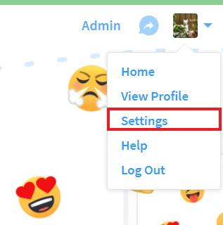
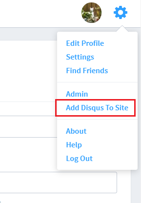
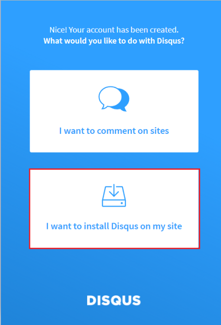
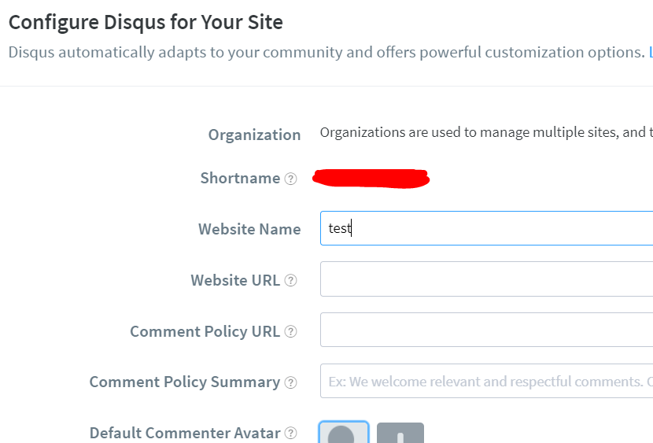
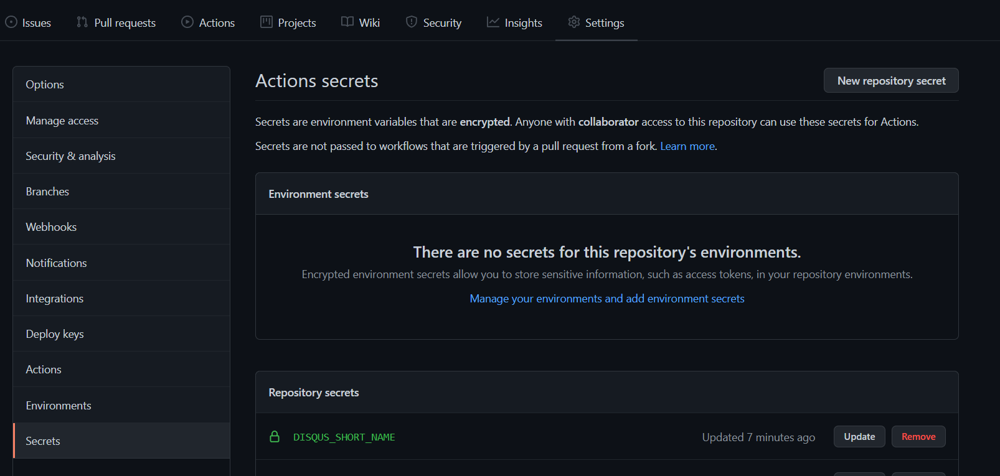
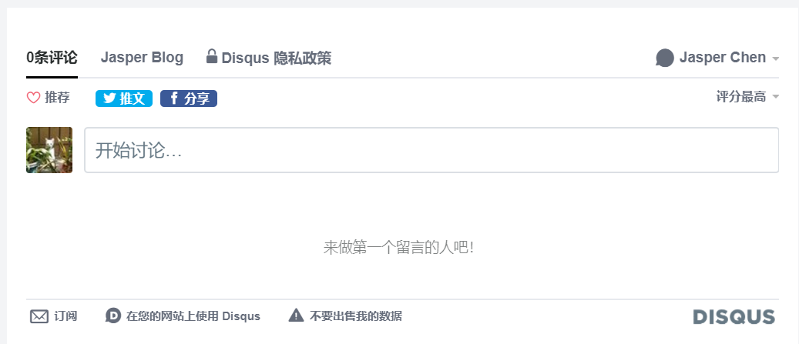

# 建立 Disqus 專案

在 Disqus 登入後到個人的 Settings 



再到右上選單選 Add Disqus To Site
 
 

接著是一長串的介紹，直接捲到最底下選擇 Get Started。

選擇 I want to install Disqus on my site 。

 

接下來的表單設定網站的名稱，類型跟語言，之後可以再改，都輸入後選擇 Create Site。

專案建好後選擇設定，找到 Shortname 的值並記下來。




這樣 Disqus 就設定好了，接著回到 Hugo 加入 Disqus 的元件。

# Hugo 加入 Disqus 元件

Hugo 本身已經有預設的 Disqus 套件，大部分部落格類別的主題會已經有加上了。

```go
{{ template "_internal/disqus.html" . }}
```

如果是用這個組件的話接下來只要在 config 中設定 `disqusShortname` 參數即可，用的就是剛剛在 Disqus 建立專案後取得的 `Shortname`。

```toml
disqusShortname = ""
```

不過設定後在 Local 的 Dev Server 建成的網站上也沒辦法看到 Disqus 的畫面，因為預設在 Local 環境是不會應用的，要等上傳到 Github Page  才看的到。

```
Disqus comments not available by default when the website is previewed locally.
comments powered by Disqus
```


# 設定 Github 環境變數

Disqus 的 `Shortname` 是個私鑰，所以不應該直接寫在 commit 當中，這時候要運用 Github 的 Secret 設定跟 Github Action 動態設定環境變數的功能。

首先在部落格的 Repo 中建立對應 Disqus Shortname 的 Secret，路徑: Settings > Secrets，這邊建的名稱叫做 `DISQUS_SHORT_NAME`。



接著來修改一下 CI 文件的流程，在進行 Hugo Build 的時候指定 `disqusShortname` 的值為剛剛建立的 `DISQUS_SHORT_NAME`。

Hugo 讀取環境變數的方法是當環境變數的名稱以 `HUGO_` 開頭的話，就會將其後的名稱作為 config 的名稱並帶入其值然後建置，所以設定環境變數 `HUGO_disqusShortname` 的話就能修改 config 中 `disqusShortname
`的值。

```yaml
# 用 Hugo 編譯靜態檔案，使用 production config
- name: Build
run: hugo --minify --environment production
env:          
    HUGO_disqusShortname: ${{ secrets.DISQUS_SHORT_NAME }}
```

這樣當推上新的 main 分支並建置後文章底下就會出現 Disqus 面板了。

